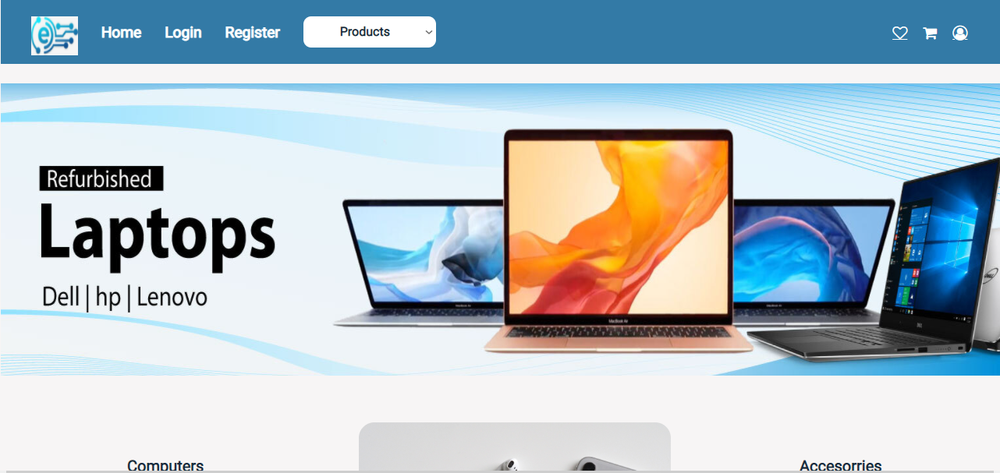
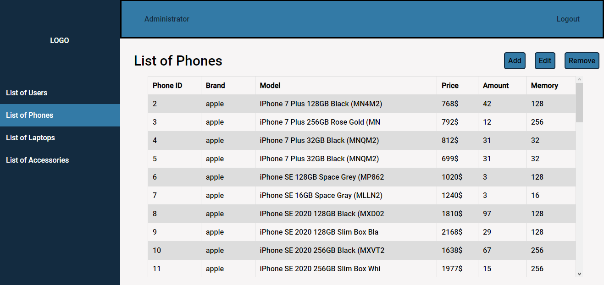
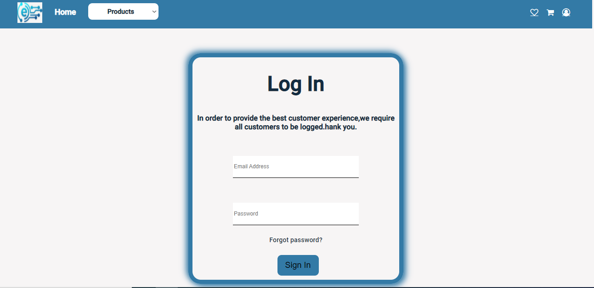
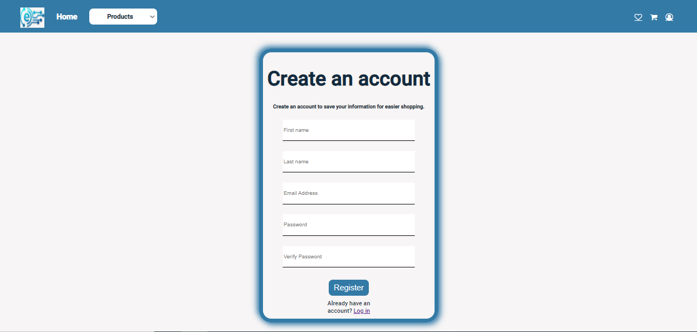
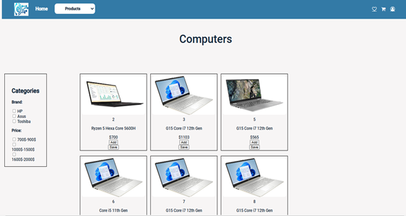

# Goal:

To learn about APIs and MySQL and implement this knowledge in a full stack ecommerce website

# The team:

1. Mohamad Balouza
2. Mohamad karim
3. Mohamad Husseini
4. Hanadi Abou Hamdan

# Color Palette used:

- #132B40
- #337AA6

# User Stories:

- As a customer I want to:
    - Sign up so that I can save my credentials on the website
    - Login so that I can go back to my user profile and products
    - Reset ( or forget ) Password in case I happen to forget what my password was
    - Purchase Products so that I can choose and buy whatever I see on the website
    - Favorite Products so that I can come back to buy the product at a different time when I for example got the money to buy it wihout having to search for it again
    - Check the cart so that I can check all the products that I chose and how much they cost with the total
    - Edit my profile so that I can change my name or age etc. and maybe to correct a typo that I didn't notice
    - Display product details so that I can be sure I want that specific product but I don't see enough information to make me certain of my choice
- As an admin I want to:
    - Display all the users so that I can see who's joining my website
    - Add products so that I can expand my shop
    - Edit the products so that I can add information, or maybe fix a typo, or maybe there have been a change to the price
    - Remove products so that I can scrap away unavailable products

# Wireframes:

| Home Page | Admin Page | Login Page | Register Page | Products Page |
| ----------- | ----------- | ----------- | ----------- | ----------- |
|  |  |  |  | 

# Implementation of these Wireframes:

| Home Page | Admin Page | Login Page | Register Page | Products Page |
| ----------- | ----------- | ----------- | ----------- | ----------- |
|  |  |  |  | 

# How to run:

To run this project you just have to do these simple steps:

1. download [Xampp](https://www.apachefriends.org/download.html)
2. git clone this repository ( This is the front end of the website ) in the xampp/htdocs folder
3. git clone the [backend](https://github.com/mohamad-kareem/-Full-Stack-E-commerce--back-end-) of the website in the xampp/htdocs folder
4. Download the following DataBase (On hold) [^1]
5. start the xampp server (Apache and MySQL)
6. the website is now online, you can open the website with the index.html

[^1]: The Database link will be available after the presentation day